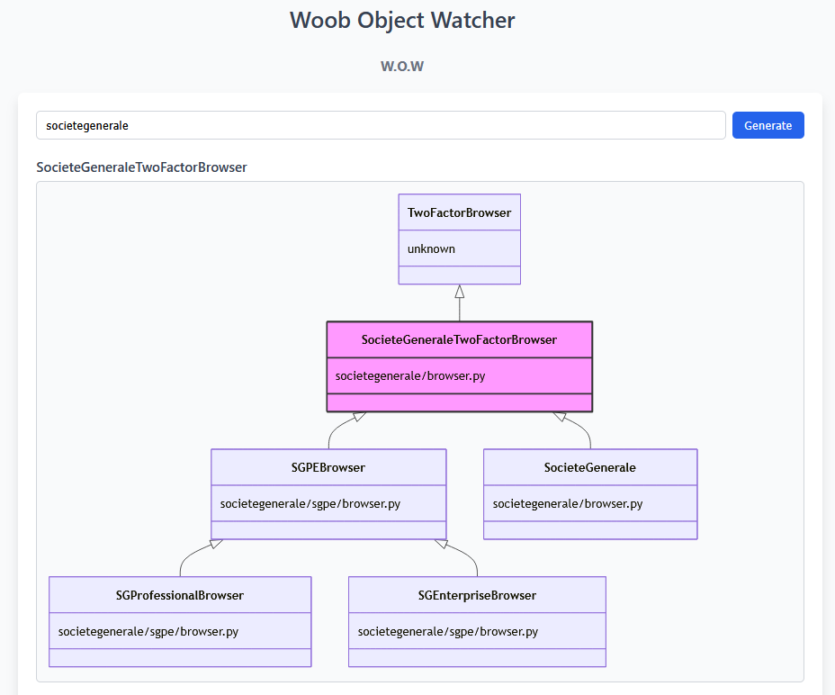

# 🌳 Woob Object Watcher (WoW)



A class inheritance visualizer for Woob modules, using [Mermaid js](https://github.com/mermaid-js/mermaid) for rendering. Built with a React frontend and Flask backend.

## ⚙️ How it works ?

- Search for a Woob module

- Finds the class(es) in browser.py file

- Builds inheritance trees (parents and children)

- Renders diagram(s) using Mermaid


## 🛠️ Install and Run 

1. Clone the repo (in `dev` folder or anywhere containing woob):

   ```bash
   git clone https://github.com/NassAbd/WoW
   cd Wow
   ```

2. Run :

   ```bash
   docker-compose up --build
   or
   docker compose up --build
   ```